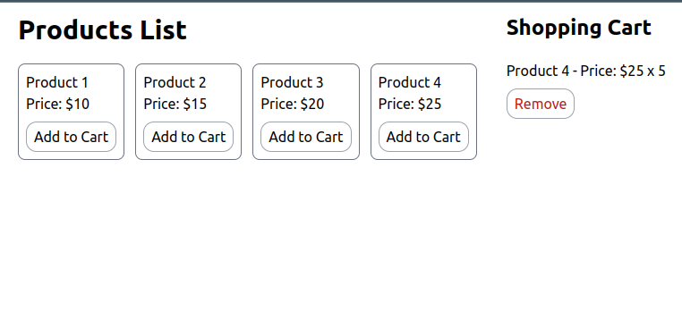

# Shopping Cart



## Overview

This project is a JavaScript assignment developed for Bohubrihi, an online learning platform. It implements a shopping cart using the following technologies:

- HTML
- JavaScript
- Tailwind CSS
- Vite for bundling
- GitHub (Version Control)
- Vercel (Deployment)

## Project Description

The Shopping Cart project aims to create an interactive shopping cart application. Users can add and remove items from their cart. It demonstrates proficiency in web development technologies and JavaScript programming.

## Features

- Add items to the cart
- Remove items from the cart
- User-friendly and responsive design using Tailwind CSS

## How to Run

To run this project locally, follow these steps:

1. Clone the repository from GitHub:

   ```bash
   git clone git@github.com:shamim-001/shopping_cart.git
   ```

2. Navigate to the project directory:
   ```bash
   cd shopping_cart
   ```
3. Install project dependencies:

```bash
npm install
```

4. Start the development server:

```bash
npm run dev
```

## Deployment

This project is deployed on Vercel. You can access the live demo [here]().
